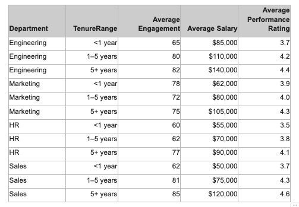

# **Storytelling com Dados: Engajamento dos Funcionários**

Esta análise tem como objetivo analisar o resultado da pesquisa anual de engajamento dos funcionários. O foco foi aplicar conceitos de visualização e interpretação de dados.

### **1. Objetivos**

- Analisar a relação entre **tempo de permanência**, **engajamento**, **salário** e **desempenho**.
- Identificar departamentos com comportamentos atípicos ou oportunidades de melhoria.
- Comunicar os resultados de forma visual e narrativa, facilitando a tomada de decisão pela gestão.

### **2. Planejamento da Análise**

Antes de iniciar a análise, foram definidas as seguintes **perguntas de negócio**:

- Como o engajamento varia entre os departamentos e faixas de tempo de empresa?
- Existe correlação entre salário, desempenho e engajamento?
- Quais departamentos apresentam comportamentos fora do esperado?

### **3. Coleta e Limpeza de Dados**
**Ferramenta**: Excel

**Fonte de dados:**

Tabela única com resultados da pesquisa anual, contendo as colunas:

`Department`, `TenureRange`, `AverageEngagement`, `AverageSalary`, `AveragePerformanceRating`.

**Tratamento realizado:**

- Verificação de valores ausentes: nenhum encontrado.
- Padronização de categorias de tempo de empresa (`<1 year`, `1–5 years`, `5+ years`).
- Conversão de salários para formato numérico para permitir análises comparativas.

### **4. Exploração e Montagem da Análise**

Foram realizadas análises exploratórias por departamento, comparando:

- Engajamento × Tempo de Permanência
- Engajamento × Salário
- Engajamento × Desempenho

**Métodos analíticos:**

- Comparação de médias por grupo.
- Identificação de tendências lineares e não lineares.

### **5. Construção dos Gráficos**

Foram utilizados **gráficos de barras** para comparar engajamento entre grupos de tempo de empresa, e **gráficos de linhas** para mostrar tendências ao longo do tempo.

**Justificativa das escolhas:**

- **Barras:** ideais para comparar categorias discretas.
- **Linhas:** eficazes para mostrar evolução temporal ou tendência.

**Aplicação de boas práticas visuais:**

- **Cores:** paleta consistente e acessível (azul e laranja), com destaque para valores atípicos.
- **Simplificação:** remoção de grades desnecessárias e rótulos excessivos.
- **Hierarquia visual:** títulos claros, legendas diretas e foco no dado principal.

### **6. Criação do Storytelling**

A narrativa foi estruturada em três atos:

**INÍCIO**

- Apresentação do contexto e dos objetivos
- Gráficos iniciais mostrando **engajamento geral por departamento**

 **MEIO**

- **Profundidade analítica**: comparação entre salário, desempenho e engajamento
- **Destaque para o caso do MARKETING** como anomalia
- **Contraste com o SALES**, que mantém alto engajamento com salários menores

**FIM**

- Síntese dos insights
- **Chamada à ação**

Técnicas de **storytelling** aplicadas:

- **Suspense:** “Por que o engajamento no Marketing cai após o primeiro ano?”
- **Contraste:** Marketing × Sales.
- **Destaque de insight:** “Salário não é o único motor do engajamento.”

### **7. Reflexão sobre o Processo**

- A aplicação de princípios de storytelling tornou a análise mais persuasiva e memorável.
- A escolha certa de gráficos e cores facilitou a compreensão mesmo para não especialistas.

---
# Análise de Pesquisa Anual

**1. Introdução**

Este relatório documenta o processo completo de análise dos resultados da **Pesquisa Anual de Engajamento dos Funcionários**, com o objetivo de identificar padrões e insights estratégicos relacionados ao tempo de permanência, engajamento, salário e desempenho por departamento.

A análise  foi conduzido com base nos princípios da **Visualização de Dados e Storytelling**, que enfatiza a importância de uma narrativa clara, foco no público-alvo e uso intencional de elementos visuais para comunicar descobertas de forma eficaz e envolvente.

**2. Base de Dados e Metodologia**

**Fontes de Dados:**

- Tabela do resultado da Pesquisa Anual de Engajamento dos Funcionários

**Metodologia Aplicada:**

1. Organização dos Dados
2. Visualização
3. Análise Estratégica

**Ferramentas Utilizadas:** Excel

- Planilhas para organização
- Ferramentas de visualização para gráficos

**3. Análises Realizadas** 

- **Departamento de Engenharia:** Quanto maior o tempo de permanência na empresa maior é a média de engajamento, a partir de 1-5 ano na empresa há um aumento considerável nessa média.

- **Departamento de Marketing:** Este é o único departamento com um movimento de engajamento "inverso e inconstante": começa alto para quem tem menos de 1 ano (78), cai para o grupo de 1-5 anos (72) e depois se recupera levemente no grupo de 5+ anos (75).

- **Departamento de HR:** O engajamento apresenta um crescimento linear (60, 62, 77), com um salto significativo no grupo de 5+ anos.

- **Departamento de Sales:** O engajamento aumenta com o tempo de permanência (62, 81, 85), com um aumento considerável a partir de 1 ano na empresa e o maior salto no grupo de 5+ anos.

**Comparação Média de Engajamento VS.  Média Salarial**

- **Departamento de Engenharia:** A média salarial e engajamento aumentam de forma constante com o tempo de permanência na empresa, sugerindo uma possível correlação.

- **Departamento de Marketing:** Apesar de ter uma média salarial alta para os grupos de 1-5 anos ($80.000) e 5+ anos ($105.000), o engajamento nesses grupos é baixo, indicando que a média salarial pode não ser um fator primário para o baixo engajamento.

- **Departamento de HR:** A média salarial aumenta junto com o tempo de permanência e o engajamento, sugerindo uma possível correlação, mas é o departamento com a menor média salarial geral.

- **Departamento de Sales:** A média salarial aumenta junto com o tempo de permanência e o engajamento, sugerindo uma possível correlação.

**Comparação Média de Engajamento VS.  Média de Desempenho**

- **Departamento de Engenharia:** O desempenho aumenta, assim como o engajamento e tempo de permanência, sugerindo uma possível correlação.

- **Departamento de Marketing:** Apesar do baixo engajamento a partir do 1-5 anos e 5+anos, a média de desempenho, se mantém na média dos demais departamentos e apresenta aumento contínuo (3.9, 4.0, 4.3).

- **Departamento de HR:** A média de desempenho também cresce (3.5, 3.8, 4.1), mas é considerada baixa em comparação com os outros departamentos. É importante notar que as notas de desempenho para os grupos de <1 ano e 1-5 anos estão abaixo de 4.

- **Departamento de Sales:** O desempenho aumenta com o tempo de permanência (3.7, 4.3, 4.6), sendo o grupo de 5+ anos o que apresenta a maior média de desempenho entre todos os departamentos.

**4. Análise Final**

O tempo de permanência podem está positivamente correlacionados com o engajamento, o desempenho e a remuneração nos departamentos de **Engenharia**, **HR** e **Sales.** 

No entanto, o departamento de **Marketing** se apresenta como uma anomalia, indicando que os fatores que influenciam o engajamento são mais complexos e não se resumem apenas ao salário ou desempenho. 

No **Marketing**, o engajamento cai após o primeiro ano, apesar da média salarial e de desempenho serem consideradas boas, sugerindo que outros fatores (cultura, liderança, oportunidades de crescimento, etc.) podem estar impactando negativamente a satisfação dos funcionários com maior tempo de serviço. Recomenda-se realizar uma pesquisa de acompanhamento focada em liderança e satisfação cultural no departamento de Marketing

O departamento de **Vendas** é um ponto forte, mostrando que é possível ter o maior engajamento e desempenho mesmo com uma média salarial comparativamente mais baixa, reforçando que a remuneração não é o único motor de engajamento e desempenho.

Por fim, o departamento de **HR** requer atenção devido às baixas médias de desempenho nas faixas de permanência mais curtas (<1 ano e 1-5 anos).
